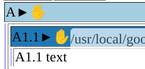
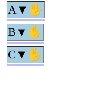
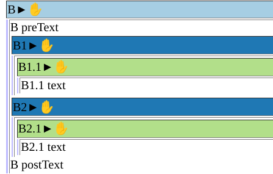
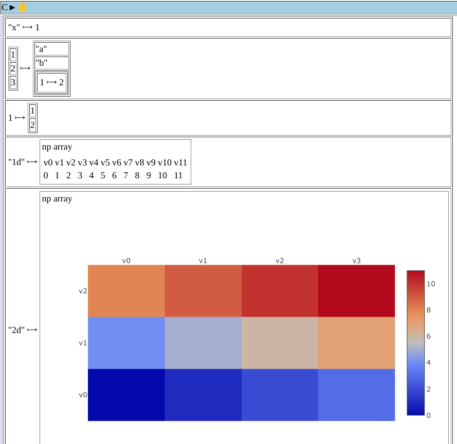
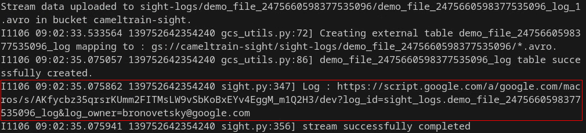

# Sight Documentation

This document details the key steps needed to start using the Sight system.

1. The [Prerequisites](#prerequisites)      section details all the steps
    needed to configure Sight to work within a given GCP project, including
    accounts, accessing the Sight codebase and launching the Sight server.
2. The [Logging API](#logging-api) section summarizes Sight's APIs
    for logging the application's execution so that it can be visualized,
    searched or analyzed by external tools.
3. Section [Decision API](#decision-api) describes Sight's APIs for
    using external ML libraries to control or optimize the application's
    execution to achieve the user's objectives.
4. Section [Sight Utilities](#sight-utilities) details useful supporting
    tools that make it easier to use Sight.

## Prerequisites

### Installation of Basic Packages

```bash
# Install basic libraries
sudo apt-get update
sudo apt install git
sudo apt install virtualenv
sudo apt-get install python3-pip
```

#### Install docker

##### for Google-internal user (on cloudtop)

```bash
# Remove old docker-* packages (if installed)
sudo apt remove docker-engine docker-runc docker-containerd

sudo glinux-add-repo docker-ce-"$(lsb_release -cs)"
sudo apt update
sudo apt install docker-ce

# If the previous command fails, you may need to clear your
# docker lib (rm -rf /var/lib/docker) as well. Doing this will delete
# all images on disk. Ensure that they are backed up somewhere
# if you don't want this to happen.

# Sudoless Docker
sudo addgroup docker
sudo usermod -aG docker $USER
# In order for the above to take effect, logout and log back in
# (or reboot if that does not work), or use newgrp docker to
# change your primary group within a terminal.
```

##### for GCP (on VM)

```bash
# Add Docker's official GPG key:
sudo apt-get update
sudo apt-get install ca-certificates curl gnupg
sudo install -m 0755 -d /etc/apt/keyrings
curl -fsSL https://download.docker.com/linux/debian/gpg | sudo gpg --dearmor -o /etc/apt/keyrings/docker.gpg
sudo chmod a+r /etc/apt/keyrings/docker.gpg

# Add the repository to Apt sources:
echo \
  "deb [arch="$(dpkg --print-architecture)" signed-by=/etc/apt/keyrings/docker.gpg] https://download.docker.com/linux/debian \
  "$(. /etc/os-release && echo "$VERSION_CODENAME")" stable" | \
  sudo tee /etc/apt/sources.list.d/docker.list > /dev/null
sudo apt-get update

# Install the Docker packages.
sudo apt-get install docker-ce docker-ce-cli containerd.io docker-buildx-plugin docker-compose-plugin

# Verify
sudo docker run hello-world

# Run Docker Commands Without Sudo
# Need to close and start the terminal again for this to get effect
sudo usermod -aG docker $USER
```

#### Get code from github

```bash
# clone and fetch latest sigh code from github
cd ~/
git clone https://github.com/theteamatx/x-sight.git
```

#### Python Version Compatibility

This application is compatible with Python versions 3.9 and 3.10. If you don't have either of these versions installed, you can follow these steps to set up the supported Python version using pyenv:

```bash
# Install all the required packages
sudo apt install curl git-core gcc make zlib1g-dev libbz2-dev libreadline-dev libsqlite3-dev libssl-dev libffi-dev lzma liblzma-dev

# Grab the the latest pyenv source tree from its Github repository
git clone https://github.com/pyenv/pyenv.git $HOME/.pyenv
```

```bash
# Set the environment variable PYENV_ROOT
vim $HOME/.bashrc
```

```bash
## add pyenv configs in .bashrc file
export PYENV_ROOT="$HOME/.pyenv"
export PATH="$PYENV_ROOT/bin:$PATH"

if command -v pyenv 1>/dev/null 2>&1; then
  eval "$(pyenv init -)"
fi
```

```bash
# source $HOME/.bashrc file or restart the shell
source $HOME/.bashrc
```

```bash
# Install supported python version
pyenv versions
pyenv install 3.10.12
pyenv global 3.10.12
source $HOME/.bashrc
pyenv global
```

After installing the supported Python version (3.9 or 3.10), you can proceed with creating virtualenv and install required depencies.

#### Create virtual env

```bash
# Create and set-up new virtual environment
cd ~/
mkdir venvs
cd venvs
# 3.9 should work if 10 doesn't
virtualenv sight_env --python=python3.10
source ~/venvs/sight_env/bin/activate

# Install setup.py compatible setuptools
pip install setuptools==58.2.0
# Install necessary dependencies from requirement.txt file
pip install -r ~/x-sight/py/sight/requirements.txt
```

Note : if error ```ModuleNotFoundError: No module named 'virtualenv'``` occurs, try installing virtualenv using pip,
```sudo pip install virtualenv```

#### Activate virtual env

```bash
# Set python path and reload the bashrc file
echo 'export PYTHONPATH="$HOME/x-sight/py:$HOME/x-sight:$PYTHONPATH"' >> ~/.bashrc
source  ~/.bashrc
# Activate virtual env
source ~/venvs/sight_env/bin/activate
cd ~/x-sight
```

#### Setup yapf in vscode

add extention eeyore.yapf in vscode.
add .vscode folder in the repo and create settings.json file which will override the defauls settings of the vscode
add following code snippet there or change accordingly if you already have custom setting

```json
{
  "[python]": {
    "editor.formatOnSaveMode": "file",
    "editor.formatOnSave": true,
    "editor.formatOnType": true,
    "editor.defaultFormatter": "eeyore.yapf",
  },
  "python.analysis.typeCheckingMode": "off",
  "yapf.args": ["--style", "{based_on_style: Google, indent_width: 2, column_limit: 80}"],
}
```

you might need to restart vscode to see the changes

If you are setting up this first time and want to apply this style to existing repo
create .config folder in the repo

1. Create .style.yapf file with following content in .config folder

```text
[style]
based_on_style = google
indent_width = 2
column_limit = 80
```

1. Create .isort.cfg file with following content in .config folder

```text
[settings]
profile = google
use_parentheses = true
line_length = 80
multi_line_output = 3
```

run the following commands from root folder of the repo to apply those style changes

```bash
yapf -ir -vv --style .config/.style.yapf .
isort . --settings-path .config/ -v
```

#### setup pre-commit hook

this pre-commit hook checks for the same formatting style we just setup locally

```bash
pip install pre-commit
```

- make sure you created .style.yapf and .isort.cfg file in .config folder from the previous step.
- make sure your repo contains .pre-commit-config.yaml file in root directory of repo

## pre-commit

### Setting Up Pre-Commit in Your Repository

`pre-commit` is a framework for managing and maintaining multi-language pre-commit hooks. This ensures that your code adheres to predefined standards and guidelines before committing it to a repository.

### Installation

First, ensure you have Python installed. Then, install `pre-commit` globally using `pip`:

You can install `pre-commit` using `pip`:

```bash
pip install pre-commit
```

### Initialize pre-commit in your repository

```bash
pre-commit install
```

### Create the `.pre-commit-config.yaml` File

Add a `.pre-commit-config.yaml` file in the root of your repository. Below is an example configuration file:

```yaml
repos:
  - repo: https://github.com/pre-commit/pre-commit-hooks
    rev: v4.0.1
    hooks:
      - id: trailing-whitespace
        exclude: ^.*\.patch$

      - id: end-of-file-fixer
        exclude: ^.*\.patch$

      - id: check-yaml

  - repo: https://github.com/pre-commit/mirrors-isort
    rev: v5.10.1
    hooks:
      - id: isort
        args: ["--settings-path", ".config/.isort.cfg"]

  - repo: https://github.com/google/yapf
    rev: v0.31.0
    hooks:
      - id: yapf
        name: yapf and isort
        entry: bash -c "yapf --style .config/.style.yapf -i $@ && isort --settings-path .config/.isort.cfg $@"
        language: system
        types: [python]

```

### When you run `git-commit`

- pre-commit will run all the hooks defined in `.pre-commit-config.yaml` on the staged files.

- If any hook fails, the commit is aborted. You’ll need to fix the issues, stage the changes again, and retry committing.

#### Example Workflow

```bash
  git add file.py
  git commit -m 'Add new code'
```

- If hooks pass , the commit is successful
- If a hook fails (e.g., trailing whitespace is detected), you'll see an error, and the commit will not go through.

### Advantages of Using Pre-Commit with Git

- **Consistency**: Enforces coding standards across all contributors.
- **Error Prevention**: Catches issues like merge conflicts, missing files, or format problems before they make it into the repository.
- **Automation**: Some hooks (e.g., code formatters like black or isort) can automatically fix issues for you.
- **Customization**: You can define custom hooks to enforce rules specific to your project.

## Test Cases

### 🧪 Test Suite Structure and Automation Overview

Welcome to the test automation setup of this repository! Our test suite is designed for clarity, scalability, and seamless automation using **pre-commit hooks** and **GitHub Actions**. This ensures that all code changes are validated through a robust testing pipeline before integration.

### 📂 Test Suite Structure

The test cases are organized in a **folder-based hierarchy** to provide clear separation between different features and test types. This organization makes it easy to locate, manage, and run specific tests. Here's an overview of the structure:

```text
root/
  ├── feature1/
  │ └── tests/
  │   ├── functional/
  │   ├── integration/
  │   └── performance/
  ├── feature2/
  │ └── tests/
  │   ├── functional/
  │   ├── integration/
  │   └── performance/
  └── tests/
    └── discover_and_run_tests.py

```

### 🔍 Test Types Explained

- **Functional Tests**: Located under each feature’s `tests/functional/` folder. These tests validate that each feature works according to the requirements.
- **Integration Tests**: Found in `tests/integration/`, these tests verify the interactions between different modules and components.
- **Performance Tests**: Stored in `tests/performance/`, these tests assess the performance and responsiveness of different features.

### 🛠 Utility Scripts

- **`discover_and_run_tests.py`**: This script is responsible for discovering and running tests based on the type and pattern specified. It automates test discovery and execution using `unittest` and a custom test runner for enhanced output.

### ⚙️ Automation with Pre-commit Hooks

We use **pre-commit hooks** to ensure that tests are run before any commit is made. This prevents breaking changes from being committed to the repository. The configuration is set up in `.pre-commit-config.yml`:

```yaml
.pre-commit-config.yml

- repo: local
  hooks:
    - id: run-functional-tests
      name: Run all functional unit-tests
      entry: python tests/discover_and_run_tests.py --type functional
      language: system
      always_run:
```

#### 💡 How It Works

- **Hook ID**: `run-functional-tests` – This hook is configured to run all functional tests before a commit is made, ensuring no breaking changes are introduced.
- **Entry Point**: The hook uses the command `python tests/discover_and_run_tests.py --type functional` to execute the `discover_and_run_tests.py` script. The `--type functional` argument specifies that only functional tests are to be executed.
- **Always Run**: The `always_run` option ensures that the hook executes every time a commit attempt is made, making it a reliable safeguard against introducing untested changes.

### 🚀 Continuous Integration with GitHub Actions

GitHub Actions automate the execution of tests whenever changes are pushed to the repository. The configuration is defined in `.github/workflows/functional-test.yml`:

```yaml
## .github/workflows/functional-test.yml

name: Run test-cases

on:
  push:

jobs:
  test:
    runs-on: ubuntu-latest

    env:
      PYTHONPATH: ${{ github.workspace }} # Set the PYTHONPATH

    strategy:
      matrix:
        test-type: [functional] # Test types

    steps:
      - name: Checkout code
        uses: actions/checkout@v2

      - name: Print Python Path
        run: |
          which python
          python -c "import sys; print(sys.executable)"
          python -c "import sys; print(sys.path)"

      - name: Install dependencies
        run: |
          python -m pip install --upgrade pip
          pip install -r requirements.txt
          pip install -r fvs/requirements.txt
          pip install absl-py==1.4.0
          pip install colorama==0.4.6

      - name: Run ${{ matrix.test-type }} test-cases
        run: |
          python tests/discover_and_run_tests.py --type ${{ matrix.test-type }}
```

#### 🔧 Key Details

- **Job Trigger**: The GitHub Action is triggered on every push event to the repository, ensuring that tests are continuously run and code changes are validated automatically.
- **Test Strategy**: A matrix strategy is used to specify different types of tests (e.g., functional). This makes it easy to expand the testing setup by adding new types of tests in the future.
- **Dependencies**: The action installs dependencies listed in the `requirements.txt` files, ensuring the testing environment is properly set up before tests are executed. This guarantees that the correct versions and dependencies are used during the test run.

### 🎯 Running Tests Locally

To manually run tests, you can use the `discover_and_run_tests.py` script. This allows developers to run specific test types directly from their local environment. Example usage:

```bash
python tests/discover_and_run_tests.py --type functional
```

- `--type`: Specify the type of tests to run (e.g., `functional`, `integration`, `performance`).

- `--pattern`: Optionally use --pattern test_*.py to specify the naming pattern for test files (default is test_*.py)

This flexible setup enables developers to execute tests based on specific criteria, ensuring efficient and targeted test runs.

### 📢 Summary

By structuring the tests and integrating **pre-commit hooks** and **GitHub Actions**, we achieve the following:

- **Code Quality**: Consistent testing ensures that code changes are validated before they are integrated, maintaining high code quality.
- **Immediate Feedback**: Developers receive immediate feedback on code changes, preventing errors and issues from being introduced into the codebase.
- **Continuous Integration**: Automated testing with GitHub Actions ensures that the repository remains stable and reliable as new changes are pushed.

This setup enhances the development experience, ensuring robust, high-quality software delivery and minimizing the risk of integration issues. 🚀

### User Permissions

Note : all the follow up commands using $PROJECT_ID assumes you have it already set to your gcp project id. If not, set it via

```bash
export PROJECT_ID=YOUR_ACTUAL_PROJECT_ID
```

For completing rest of the task from prerequisites,

- one needs owner role and directly continue to the [next](#custom-rolesservice-account) section

or

- one can
create Sight Manager role as following and assign that role to any user and
delegate the remaining tasks from prerequisites.

#### Creating Sight Manager role

```bash
gcloud iam roles create sight_manager --project=$PROJECT_ID --file=infra/sight-manager-role.yaml
```

#### Assigning role to User

```bash
gcloud projects add-iam-policy-binding $PROJECT_ID \
--member="user:$USER_ACCOUNT" \
--role="projects/$PROJECT_ID/roles/sight_manager"
```

We'll need one service account and 2 custom roles (for application
user and for service account to be used by sight spawned workers) with necessary
permissions to run the Sight.

Make sure following APIs are enabled in your gcp project

- aiplatform.googleapis.com
- lifesciences.googleapis.com
- run.googleapis.com
- cloudresourcemanager.googleapis.com

### Custom Roles/Service-account

#### Sight User

1) Create a custom role for User working with Sight from the sight-user-role.yaml file available in the root directory of repo.

    ```bash
    gcloud iam roles create sight_user --project=$PROJECT_ID --file=infra/sight-user-role.yaml
    ```

2) Assign the custom role to user.

    ```bash
    gcloud projects add-iam-policy-binding $PROJECT_ID \
    --member="user:$USER_ACCOUNT" \
    --role="projects/$PROJECT_ID/roles/sight_user"
    ```

#### Sight Service Account

1) Create the service account for sight related work

    ```bash
    gcloud iam service-accounts create sight-service-account \
        --display-name="sight service account" --project=$PROJECT_ID
    ```

2) Create a custom role for service-account with necessary permissions to
work with Sight from the sight-service-account-role.yaml file available in the
root directory of repo.

    ```bash
    gcloud iam roles create sight_service_account --project=$PROJECT_ID --file=infra/sight-service-account-role.yaml
    ```

3) Assign the custom role to the newly created service account so that this service
account can have required permissions.

    ```bash
    gcloud projects add-iam-policy-binding $PROJECT_ID \
    --member="serviceAccount:sight-service-account@$PROJECT_ID.iam.gserviceaccount.com" \
    --role="projects/$PROJECT_ID/roles/sight_service_account"
    ```

### Launching Default-service

1) Add your project details to .env file in the code

    ```bash
    echo "PROJECT_ID=$PROJECT_ID" >> .env
    echo "GENAI_API_KEY=$YOUR_ACTUAL_KEY" >> .env
    ```

2) Create service image from the code and host it on [gcr.io](http://gcr.io)

    ```bash
    docker build --tag gcr.io/$PROJECT_ID/sight-default:$(git rev-parse --abbrev-ref HEAD)-$(git rev-parse --short HEAD) -f sight_service/Dockerfile . && \
    gcloud auth print-access-token | docker login -u oauth2accesstoken --password-stdin https://gcr.io && \
    docker push gcr.io/$PROJECT_ID/sight-default:$(git rev-parse --abbrev-ref HEAD)-$(git rev-parse --short HEAD)
    ```

3) With the help of the image, launch cloud run service

    ```bash
    gcloud run deploy sight-default --image=gcr.io/$PROJECT_ID/sight-default:latest --allow-unauthenticated --service-account=sight-service-account@$PROJECT_ID.iam.gserviceaccount.com --concurrency=default --cpu=2 --memory=8Gi --min-instances=1 --max-instances=1 --no-cpu-throttling --region=us-central1 --project=$PROJECT_ID
    ```

### Hosting worker image

Host the worker image in a cloud which will be used as default image by the
workers spawned using sight unless specified otherwise.

```bash
docker build --tag gcr.io/$PROJECT_ID/sight-worker:$(git rev-parse --abbrev-ref HEAD)-$(git rev-parse --short HEAD) -f py/Dockerfile . && \
gcloud auth print-access-token | docker login -u oauth2accesstoken --password-stdin https://gcr.io && \
docker push gcr.io/$PROJECT_ID/sight-worker:$(git rev-parse --abbrev-ref HEAD)-$(git rev-parse --short HEAD)
```

## Logging API

Sight enables application developers to log the dynamic behavior of their
application at a high level of abstraction, documenting the hierarchical nesting
structure of its logic and the full details of the logged data structures. These
logs are stored in BigQuery and can be viewed via a specialized GUI that clearly
visualizes the log's structure and provides search and navigation capabilities,
powered by BigQuery.

Logging is done via an object of type Sight, which exposes a range of logging
APIs specialized to document various aspects of application behavior. A Sight
object is created as follows:

```python
def get_sight_instance():
    params = sight_pb2.Params(
         label="experiment", # Human-readable description of the application
         project_id=PROJECT_ID, # Name of the user's GCP project
         bucket_name=PROJECT_ID+"-sight", # The GCS bucket where the log is stored
    )
    sight_obj = Sight(params)
    return sight_ob
```

Sight enables users to document the logical nesting structure of their
application's execution via the Block object, which is used as follows:

```python
with Block("A", sight):
 with Block("A1.1", sight):
   sight.text("A1.1 text")
```

Everything logged to sight while a given object is in scope is nested within
that block and this containment relationship is visualized in the GUI.



And one can click on the arrow > button to close down the whole code block of
particular region and can focus on the things which are required.



The Attribute API enables users to search for regions of the log where certain
conditions hold. This mechanism lets users specify key-value pair bindings that
hold while an Attribute object is in scope. Everything logged during this time
period is marked with this key-value pair and the GUI lets users search for
regions of the log where various constraints on these key-value pairs are
satisfied.

```python
with Block("B", sight):
  sight.text("B preText")
  with Attribute("key", "B1", sight):
    with Block("B1", sight):
      with Block("B1.1", sight):
        sight.text("B1.1 text")
  with Attribute("key", "B2", sight):
    with Block("B2", sight):
      with Block("B2.1", sight):
        sight.text("B2.1 text")
  sight.text("B postText")
```



Users typically need to log complex data structures and analyze specific
components of these objects. Traditional logging systems typically require such
data structures to be serialized into some human-readable string format and then
log this string. In contrast, Sight's data_structure library logs the full
structure of objects directly, capturing their internal details within the
BigQuery database in a structured format, making it possible to visualize them
or analyze them programmatically. To use the data_structure while logging using
sight, where the first argument of log API can be any supported data_structure
supported by python.

```python
with Block("C", sight):
  data = list(range(0, 12))
  data_structures.log(
      {
          "x": 1,
          (1, 2, 3): ["a", "b", {1: 2}],
          1: [1, 2],
          "1d": np.array(data),
          "2d": np.array(data).reshape((3, 4))
      },
      sight,
  )
```



The file `sight/demo/demo.py` provides examples of how all of the above APIs may
be used and is an excellent starting point to understand the core capabilities
and how the resulting logs are visualized in Sight's GUI. To generate a log,
please edit this file to specify your own project and bucket and then run the
demo code:

```python
 python sight/demo/demo.py
```

Sight then prints out the GCS path where the log is stored, the BigQuery table
that references it, and most importantly, the URL of the Sight GUI where this
log may be viewed:



## Decision API

### Overview

While the logging API helps application developers better understand the
behavior of their applications, the decision API enables them to incorporate
machine learning into their application logic, extending their own domain
expertise with new tools from the ML community with minimal modifications to
their code. The core idea of the Decision API is that when application
developers are not sure what their application should do, they can ask Sight,
which may use a wide range of ML algorithms (e.g. Bayesian Optimization,
Reinforcement Learning, or Large Language Models) to suggest a course of action.
At a later point in the application's execution it must use Sight's Decision API
to let the ML algorithm know how effective that suggestion was so that such
suggestions may be refined in the future. Sight can train these ML models to
provide good advice by running many copies of the application in parallel on
GCP's distributed compute clusters.

The Decision API may be used by general applications to make complex decisions,
such as the choice of a caching policy, the layout of widgets on a web page
(e.g. for A/B experiments), selecting the split points in hierarchical sorting
algorithms or choosing the parameters of simulations to minimize prediction
error. To use the Decision API application developers must package their
application into a form that allows Sight to run it many times as it trains the
model and then start execution via Sight's `decision.run()` function. Currently
Sight supports the following package types:

1. If the application logic is implemented via a dm_env-type environment (e.g.
    the OpenAI gym) users can provide this environment with no modification and
    Sight will call the gym's step and reward functions.
1. Alternatively, application logic can be encapsulated in a call-back driver
    function that calls Sight's Decision API directly. Sight will then call this
    driver function one or more times during the model's training process, as
    well as during normal program execution.

### Decision API using an Environment

- To start the program users must create their environment object and pass it
    to the `decision.run()` function. This environment may be implemented by the
    application developer (e.g. ShowerEnv) or may be a ready-made environment
    from AI gym:

    ```python
    decision.run(sight=sight, env=shower_env.ShowerEnv())
    decision.run(
            sight=sight, env=wrappers.GymWrapper(gym.make(flags.FLAGS.env_name))
        )
    ```

- The code below provides an example implementation of a gym, which must
    implement methods reset(), step(), action_spec() and observation_spec().

    ```python
    class ShowerEnv(dm_env.Environment):
      """dm_env environment for managing shower temperature."""

      def __init__(self):
        self.state = 38 + random.randint(-3, 3)
        self.shower_length = 60

      def action_spec(self):
        return dm_env.specs.BoundedArray(
            shape=(), dtype=int, name='action', minimum=0, maximum=2
        )

      def observation_spec(self):
        return dm_env.specs.BoundedArray(
            shape=(),
            dtype=np.float32,
            name='observation',
            minimum=0,
            maximum=100,
        )

      def step(self, action):
        self.state += action - 1
        self.shower_length -= 1

        # Calculate reward, based on whether the shower's temperature is
        # comfortable (between 37 and 39 degrees C).
        if self.state >= 37 and self.state <= 39:
          reward = 1
        else:
          reward = -1

        # Check if shower is done
        if self.shower_length <= 0:
          done = True
        else:
          done = False

        # Return step information
        if done:
          return dm_env.termination(
              reward, np.array([self.state], dtype=np.float32)
          )
        else:
          return dm_env.transition(reward, np.array([self.state],
                                  dtype=np.float32))

      def reset(self):
        # Reset shower temperature
        self.state = 38 + random.randint(-3, 3)
        self.shower_length = 60
        return dm_env.restart(np.array([self.state], dtype=np.float32))
    ```

### Decision API without an Environment

The Decision API can be used in generic code by using the Decision API to
identify the questions that need to be asked, the format of the answers that
need to be given and add explicit calls where the application asks for guidance
and reports back on the outcomes of the ML algorithm's suggestions.

- The first step is to implement the application's entry point as a driver
    function that is passed as a parameter to the `decision.run()`call.
- Next developers must document the properties of the application's dynamic
    execution that will be communicated to the ML algorithm as context for the
    decisions it makes. These are passed to the `state_attrs`parameter and
    document the range of possible values of each state parameter.
- Finally, developers must document the format of the guidance it needs back
    from the ML algorithm as a set of named attributes and their allowed value
    ranges. These are passed to the `action_attrs`parameter.

    ```python
    decision.run(
            sight=sight,
            driver_fn=driver_fn,
            state_attrs={
                "Temperature": sight_pb2.DecisionConfigurationStart.AttrProps(
                    min_value=0,
                    max_value=100,
                    step_size=1,
                ),
            },
            action_attrs={
                "Direction": sight_pb2.DecisionConfigurationStart.AttrProps(
                    min_value=0,
                    max_value=2,
                    step_size=1,
                ),
            },
        )
    ```

- The driver function performs all the logic of the application and calls the
    following functions to interact with the ML algorithm:
  - `data_structures.log_var():`When the application logs a variable
        explicitly named as a state variable, it is communicated to the ML
        algorithm as part of the application's current state. ``
  - `decision.decision_point()`: Asks the ML algorithm for suggestions about
        how the application should execute. The response a dict with same keys
        as the `action_attrs`parameter in the `decision.run()`call and values in
        the allowed range for each such parameter.

    ```python
    action = decision_point("label", sight)
    ```

  - `decision.decision_outcome()`: Communicates to the ML algorithm
        the effectiveness of the preceding suggestion, with higher values of
        the `reward` parameter indicating that the

    ```python
    decision_outcome("label",updated_timestep.reward,sight)
    ```

- Driver function should looks something like:

    ```python
    def driver_fn(sight: Sight) -> None:
      # Initialize simulation state
      temperature = 38 + random.randint(-3, 3)
      shower_length = 60
      data_structures.log_var("Temperature", temperature, sight)

      # Simulation loop
      for _ in range(shower_length):
        # Ask Sight's optimizer for the action to perform.
        chosen_action = decision.decision_point("DP_label", sight)
        direction = np.array(chosen_action["Direction"], dtype=np.int64)

        # Change temperature based on the Sight-recommended direction.
        temperature += direction - 1
        data_structures.log_var("Temperature", temperature, sight)

        # Calculate reward based on whether the temperature target has
        # been achieved.
        if temperature >= 37 and temperature <= 39:
          current_reward = 1
        else:
          current_reward = -1

        # Inform Sight of the outcome of the recommended action.
        decision.decision_outcome(
            "DO_label",
            current_reward,
            sight,
        )
    ```

- In the case of the dm_env type RL environment provided, the default driver
    function gets run multiple times while running the simulation, if the custom
    function is not provided. The usage of decision_point and decision_outcome
    call in this driver function is shown below:

### Running Decision API-enabled applications on the command line

Applications the use the Decision API may be run in two modes:

- Training: the ML algorithm observes many runs of the application to learn
    how to make high-quality decisions, and
- Run: the ML algorithm has been trained and the application is run normally,
    guided by the trained ML algorithm.

To run the application in training mode users must run the application's binary
while setting the command line flag ```--decision_mode``` as ```train``` and must use the
following flags to control the training process:

- ```server_mode```: The procedure to use when training a model to drive
    applications that use the Decision API.

  - distributed: The application is executed in parallel on the GCP cloud.
  - docker_local: The application is executed locally in a docker container
  - local: The application is executed locally in the current OS environment

- ```optimizer_type```: The optimizer to be used while training (vizier, dm-acme,
    exhaustive_search)

- num_train_workers: Number of workers to use on the GCP cloud in a training
    run in distributed mode.

- num_trials: Total number of training trials to perform across all the local
    or distributed worker nodes.

- docker_image: docker image to used by worker nodes while running the taks

- log_path: path to store the logs of workers

Once the ML model has been trained users can use this model to guide ordinary
application runs by executing the application's binary while setting the command
line flag: ```--decision_mode``` as ```run``` and ```--trained_model_log_id``` as ```$log_id``` of generated
sight run while training.

### Example demo applications

To make it easier to experiment with the Decision API the sight/demo directory
contains the following demo applications that use the Decision API in the
different ways described above:

1. shower_demo_without_env.py (dm_acme): driver function that uses the Decision
    API explicitly.
1. shower_demo_with_env.py (dm_acme): uses the Decision API implicitly via an
    RL environment that is driven from Sight.
1. gym_demo_env.py (dm_acme): uses the Decision API implicitly to drive an AI
    gym environment that is specified via the ```--env_name``` command line flag.
1. sweetness.py: Simple program that tries to learn the level of sweetness a
    user likes and uses the explicit Decision API to describe the state and
    action attributes, as well as the decision point and outcome. Used most
    effectively with the following optimizers: vizier, exhaustive_search.
1. volterra_lotka.py: Simulation of the Volterra-Lotka predator-prey model
    using the explicit Decision API. Used most effectively with the following
    optimizers: vizier, exhaustive_search.

#### Example Training Invocation Commands

To make it easier to start experimenting with Sight, below are some example
commands for running demo files with different optimizers.

##### Without any environment

To use the sight for training optimizer, without any environment, run following
command with all the mandatory flags mentioned [here](#running-decision-api-enabled-applications-on-the-command-line):

```python
python py/sight/demo/shower_demo_without_env.py \
--decision_mode=train \
--server_mode=distributed \
--optimizer_type=dm_acme \
--num_train_workers=2 \
--num_trials=5 \
--acme_agent=dqn \
--docker_image=gcr.io/$PROJECT_ID/sight-worker
```

##### With environment

To use the sight for training optimizer with gym environment, add env_name flag
in addition to all the mandatory flags for any other dm_env type environment, no
need to pass env_name flag:

```python
python py/sight/demo/gym_demo_env.py \
--decision_mode=train \
--server_mode=distributed \
--optimizer_type=dm_acme \
--num_train_workers=2 \
--num_trials=5 \
--acme_agent=dqn \
--docker_image=gcr.io/$PROJECT_ID/sight-worker \
--env_name=CartPole-v1
```

#### Vizier

To use sight with vertex AI vizier for hyperparameter turning one can use the
following

```python
python py/sight/demo/sweetness.py \
--decision_mode=train \
--server_mode=distributed \
--optimizer_type=vizier \
--num_train_workers=2 \
--num_trials=5 \
--docker_image=gcr.io/$PROJECT_ID/sight-worker
```

#### Exhaustive Search

```python
python py/sight/demo/sweetness.py \
--decision_mode=train \
--server_mode=distributed \
--optimizer_type=exhaustive_search \
--num_train_workers=2 \
--num_trials=5 \
--docker_image=gcr.io/$PROJECT_ID/sight-worker
```

## Sight Utilities

### Check status

After running the larger experiment, If the user wants to check the status of
their experiment, they can run the current_status.py file to check the same.
This file calls the server and gets the latest status of the experiment. User
can run this file as follows:

```python
python py/sight/widgets/decision/current_status.py --project_id=$PROJECT_ID --log_id=SIGHT_LOG_ID
```

### Private server

Sight applications are trained using a single default server process that is
hosted on CloudRun and is shared among all users of a given GCP project. As this
may cause contention and slowdowns users may also start one or more private
Sight servers that are dedicated to individual training or logging workloads.
This is done by passing the desired unique name of the server in the
`--service_name` command line parameter while running the experiment. Users may
also use the `--service_docker_file` to specify a specific custom build of Sight
(e.g. if they're experimenting with ML algorithms).

Taking example from [here](#with-environment), and adding above mentioned
flags:

```python
python py/sight/demo/gym_demo_env.py \
--service_name=new-service \
--service_docker_file=server/Dockerfile \
--decision_mode=train \
--server_mode=distributed \
--optimizer_type=dm_acme \
--num_train_workers=2 \
--num_trials=5 \
--docker_image=gcr.io/cameltrain/sight-worker-meet \
--env_name=CartPole-v1
```

### Local server

Instead of running sight service on cloudrun, User can run it locally on the same machine where we are running the root process. This helps in faster development, testing and saves time required to create the service image and deploying it on cloud run, after each minor change in server-side logic.

For this, User can run service_root script from one terminal session

```python
cd ~/x-sight
python sight_service/service_root.py
```

And from another terminal session, User can run any valid command from [this](#example-training-invocation-commands) section and change the flag ```--server_mode=local``` to indicate that sight_service is running locally.

### VM server

As cloud-run periodically restarts the container, if you want to run the experiment for longer duration (24 hours), you can deploy the server on vm, client and worker can hit that server using internal IP of the VM. Here's the setup you'll need

- Create VM with sight-service-account
- SSH into the VM and pull the server docker image on VM

```bash
docker pull gcr.io/cameltrain/sight-dev-service:15oct
```

- Bind your cloudtop's 8080 port to VM's 8080 port so, we can send request to server on VM using localhost from cloudtop (as this VM and our cloudtop are not in the same network, we can't connect to it's internal/external IP)

```bash
gcloud compute ssh $INSTANCE_NAME --project $PROJECT_ID --zone $INSTANCE_ZONE  -- -o ProxyCommand='corp-ssh-helper %h %p' -L localhost:8080:localhost:8080
```

- once you ssh'ed into the vm from the above command, start server container on VM

```bash
docker run -it -p 8080:8080 gcr.io/cameltrain/sight-dev-service:15oct
```

- this will bind container's 8080 port to VM's 8080 port, which enventually points to cloudtop's 8080 port so, client can direcly ping localhost from cloudtop but will be using the server deployed on VM

Note :

while spawning mulitple workers, It may hit the limit of maximum allowed IP address in the given region, so we're spawning workers with only internal IP. This creates another issue as this VM, can't connect with any external link but what if our server is deployed on cloud run?

for that, we have to enable Private Google Access in the default subnet vpc network to allow all the VMs in that region to reach the external IP addresses of Google APIs and services, in our case - cloud run.

So, make sure the subnet of the vpc network for region you specified while spawning workers has this Private Google Access enabled
